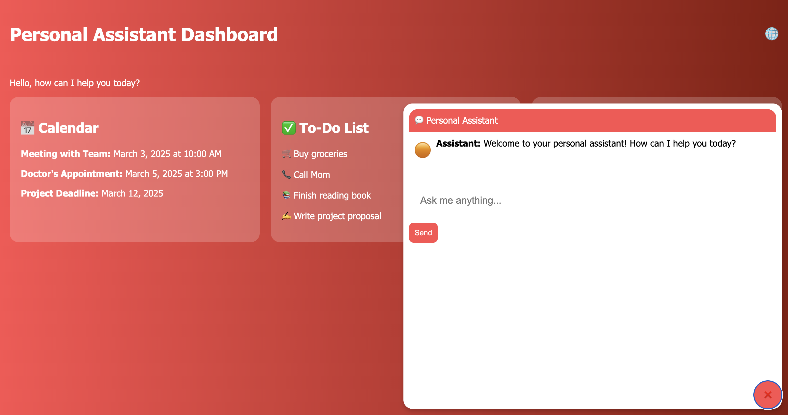

# Quarkus + MCP = Agentic 

This project uses Quarkus, the Supersonic Subatomic Java Framework and the
[Model Context Protocol](https://modelcontextprotocol.io/) to implement a simple agentic app using multiple MCP servers and Quarkus + LangChain4j.

If you want to learn more about Quarkus, please visit its website: https://quarkus.io/ .

## Running the application in dev mode

You'll need `node` and `npm` installed (this is used to start mcp services). Follow the [recommended way](https://nodejs.org/en/download) to install for your system.

You will also need a container environment available (e.g. Podman or Docker) if you want to see built-in telemetry, which you can access once the app is up by going to the Dev UI and finding the Grafana link. If you don't have a container environment, comment out the part in `application.properties` dealing with telemetry.

Create a directory called `playground` at the root folder of your clone if you wish to use the `filesystem` MCP server (or change the name in `application.properties` to some other name, but the directory must exist)

Several of the MCP services require API keys. Here are links to get the keys:

* [Brave web search](https://brave.com/search/api/)
* [Open AI](https://platform.openai.com/docs/quickstart)
* [Google Maps](https://developers.google.com/maps/documentation/javascript/get-api-key#create-api-keys)
* [Slack](https://github.com/modelcontextprotocol/servers/tree/main/src/slack#setup) (follow the instructions to get your _Bot User OAuth Token_ that starts with `xoxb-`, and your _Team ID_)

Once you have all that, the easiest way is to create a file called `.env` in your clone (this file is listed in `.gitignore` so won't be pushed to GitHub if you fork this repo and make the file). The `.env` file should look like:

```properties
quarkus.langchain4j.mcp.bravesearch.environment.BRAVE_API_KEY=<YOUR BRAVE API KEY HERE>
quarkus.langchain4j.mcp.googlemaps.environment.GOOGLE_MAPS_API_KEY=<YOUR GMAPS API KEY HERE>
quarkus.langchain4j.mcp.slack.environment.SLACK_BOT_TOKEN=<YOUR SLACK BOT TOKEN HERE>
quarkus.langchain4j.mcp.slack.environment.SLACK_TEAM_ID=<YOUR SLACK TEAM ID HERE>
quarkus.langchain4j.openai.api-key=<YOUR OPENAI API KEY HERE>
```

These variables will automatically be included when you run Quarkus in Dev mode. You can also put them directly in `application.properties` but be careful not to check them into a public source repository!

For production use, these should obviously be treated differently, stored in secure places like vaults or kubernetes Secrets, and injected as environment variables at runtime.

But for testing, you can run your application in dev mode that enables live coding using:
```shell script
./mvnw compile quarkus:dev
```
In Dev mode, you can use the Dev UI to chat with the LLM you've configured by going to "Extensions" and clicking "Chat" to chat. You'll find the system message pre-filled in from the content from [Bot.java](src/main/java/Bot.java)

> **_NOTE:_**  Quarkus now ships with a Dev UI, which is available in dev mode only at http://localhost:8080/q/dev/.

## Testing the app

There is a simple frontend application to test the assistant - access `http://localhost:8080` and you should see:



Click on the chat box icon at the lower left and issue some sample prompts to see how it uses agent reasoning to invoke the various tools:

```console
My name is John Doe. I am a member of a team of 2 myself and Daniel Jane. I like Asian food, while Daniel is on a strict gluten-free diet.

Please find one good restaurant in Atlanta, GA with the highest rating that meets
the team's dietary needs and preferences. Then, invite the team to a lunch
at 12pm next Wednesday using the slack channel "#lunchtime".
In your message, include the name and description of the restaurant, the time and
date of the lunch, and driving directions from Georgia World Congress Center.
Also create an ICS calendar file for me to use in my calendar in the
"playground/calendar" directory.`
```

And some simpler follow-up prompts like:

* What was the reasoning you used to arrive at that recommendation?
* How did you choose the restaurant?
* What actions did you take for each step and which tools did you use?
* Why did you search for gluten-free restaurants?
* What did you remember about each person on the team?

In Dev mode, you can also use the Dev UI to chat with the LLM you've configured by going to "Extensions" and clicking "Chat" to chat. You'll find the system message pre-filled in from the content from [Bot.java](src/main/java/Bot.java)

> **_NOTE:_**  Quarkus now ships with a Dev UI, which is available in dev mode only at http://localhost:8080/q/dev/.

## Packaging and running the application

The application can be packaged using:
```shell script
./mvnw package
```
It produces the `quarkus-run.jar` file in the `target/quarkus-app/` directory.
Be aware that it’s not an _über-jar_ as the dependencies are copied into the `target/quarkus-app/lib/` directory.

The application is now runnable using `java -jar target/quarkus-app/quarkus-run.jar`.

If you want to build an _über-jar_, execute the following command:
```shell script
./mvnw package -Dquarkus.package.type=uber-jar
```

The application, packaged as an _über-jar_, is now runnable using `java -jar target/*-runner.jar`.

## Creating a native executable

You can create a native executable using:
```shell script
./mvnw package -Dnative
```

Or, if you don't have GraalVM installed, you can run the native executable build in a container using:
```shell script
./mvnw package -Dnative -Dquarkus.native.container-build=true
```

You can then execute your native executable with: `./target/research-1.0-SNAPSHOT-runner`

If you want to learn more about building native executables, please consult https://quarkus.io/guides/maven-tooling.

## Related Guides

- LangChain4j Model Context Protocol client ([guide](https://docs.quarkiverse.io/quarkus-langchain4j/dev/index.html)): Provides the Model Context Protocol client-side implementation for LangChain4j
- LangChain4j OpenAI ([guide](https://docs.quarkiverse.io/quarkus-langchain4j/dev/index.html)): Provides the basic integration with LangChain4j
